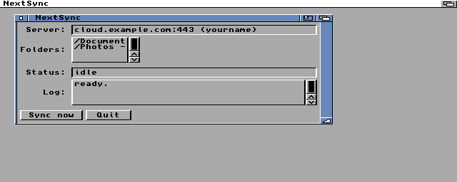

# NextSync

A Nextcloud client for AmigaOS 3.1 and later. Keeps folders on your Amiga in
sync with folders on a Nextcloud server, over HTTPS with real certificate
verification.



Around 39 KB. Workbench GUI and a scriptable CLI in one binary. Targets the
A1200 and A4000; tested on 68020 without an FPU and on 68040.

---

## What it does

- **Two way sync.** Changes on either side are carried to the other. New
  files, modified files, new directories, deletions.
- **Change detection that survives reboots.** The server's etag and the
  local size and modification time are recorded after every transfer, so a
  second run transfers nothing and a third run after editing one file
  transfers exactly that file.
- **Conflicts are never resolved by losing data.** If a file changed on
  both sides, the local copy is renamed to `<name>.conflict` and the server
  version is downloaded, so both survive.
- **Deletions are safe on first contact.** A deletion is only propagated
  for a file the state file proves was synced before, so pointing NextSync
  at a folder that already has content never deletes anything.
- **Streaming transfers.** 16 KB blocks; files never have to fit in RAM.
  Downloads land in `<name>.nspart` and are renamed into place only when
  complete, so an interrupted transfer cannot leave a corrupt file.
- **TLS 1.3** via AmiSSL v5, verified against the AmiSSL CA store.
- Local modification times are preserved on the server (`X-OC-MTime`).

## Requirements

| | |
|---|---|
| AmigaOS 3.1 or later, 68020+ | AmiSSL v5 needs a 68020 |
| ~6 MB free RAM | OpenSSL 3.x is not small |
| A TCP/IP stack | Roadshow, AmiTCP, Miami — anything with `bsdsocket.library` v4 |
| [AmiSSL 5.x](https://github.com/jens-maus/amissl/releases) | run its installer; needs an `AmiSSL:` assign |
| `mathieeedoubbas.library` and `mathieeedoubtrans.library` in `LIBS:` | ships with Workbench; AmiSSL's startup needs them |

## Installing on a real Amiga

1. Install AmiSSL 5.x with its own installer.
2. Copy `NextSync` anywhere you like.
3. Copy `NextSync.conf.example` next to it as `NextSync.conf` and edit it.

## Configuration

`NextSync.conf` lives in the same drawer as the program (`PROGDIR:`):

```
server  cloud.example.com
port    443
user    yourname
pass    your-app-password

pair    /Documents   DH0:Sync/Documents
pair    /Photos      Work:Cloud/Photos
```

One `pair` line per folder, up to 16. Both sides are created if missing.

Use a Nextcloud **app password** (Settings → Security on the server) rather
than your account password: this file is plain text, and an app password
can be revoked on its own.

## Using it

```
NextSync            open the GUI
NextSync SYNC       sync every pair and exit, for scripts and startup
NextSync LIST [p]   list a server directory
NextSync SNAPSHOT   open the GUI, save a screen dump to out/, exit
```

During a CLI sync, CTRL-C stops cleanly after the current file finishes.

## How the sync decides what to do

For each path it compares three things: what is on the server, what is on
disk, and what the state file (`.nextsync.state`, inside the local folder)
says about the last successful sync.

| server | local | last sync | action |
|---|---|---|---|
| present, etag changed | unchanged | known | download |
| unchanged | changed | known | upload |
| present | missing | known | delete on server |
| missing | present | known | delete locally |
| present | missing | unknown | download (it is new) |
| missing | present | unknown | upload (it is new) |
| changed | changed | known | conflict: local → `.conflict`, then download |

Delete the state file to force a full re-comparison; nothing is lost,
NextSync just re-examines everything.

## Known limits

- File names containing `:` cannot exist on an Amiga filesystem and are
  skipped with a log line. Length limits are left to the filesystem: FFS
  rejects names over 30 characters, PFS3 and SFS allow around 100.
- UTF-8 names pass through as bytes. Non-ASCII names look wrong in
  Workbench but round trip to the server unchanged.
- Times are treated as UTC on both sides. Set your Amiga clock to UTC, or
  accept a constant offset — the state model tolerates it after the first
  run either way.
- One connection, one transfer at a time. This is a 68020.
- Nextcloud chunked upload is not implemented, so very large uploads depend
  on the server's request timeout.

---

## Building

You need the cross toolchain and the AmiSSL SDK. Both are fetched by
scripts; neither is committed here.

```bash
tools/build-toolchain.sh     # m68k-amigaos-gcc into toolchain/, ~20 min, once
tools/fetch-deps.sh          # AmiSSL 5.27 SDK + runtime into vendor/
make                         # -> ./NextSync
```

If you already have a toolchain or SDK elsewhere:

```bash
make TOOLCHAIN=/opt/amiga AMISSL_SDK=/path/to/AmiSSL/Developer
```

`make CPU=68030` and `make DEBUG=1` do what you would expect.

## Testing under emulation

Network tests run under [Amiberry](https://amiberry.com/). FS-UAE 3.x is
**not** usable for this: its CPU core predates 2017 and double-faults
inside AmiSSL's library init. Amiberry's `bsdsocket_emu` exposes the host
network as a native `bsdsocket.library`, so the guest needs no TCP/IP stack.

```bash
brew install --cask amiberry
pip3 install amitools                       # for xdftool

tools/setup-sysdrive.sh /path/to/WORKBENCH.ADF   # emu/hd0 from Workbench 3.1
tools/install-amissl.sh emu/hd0
cp NextSync.conf.example emu/hd0/NextSync.conf && $EDITOR emu/hd0/NextSync.conf

tools/run-emu.sh "NextSync SYNC >out/sync.log"        # 68040 + JIT, quick
tools/run-emu.sh "NextSync SYNC >out/sync.log" a1200  # stock A1200 timing
tools/run-emu.sh "NextSync GUITEST"                   # drives the GUI, snapshots it
```

Put a Kickstart ROM in `kickstarts/` (3.1 for the A1200 or A4000 — both are
68020-only ROMs, which is fine since AmiSSL needs a 68020 regardless).
`tools/emu-config.sh` generates the Amiberry configuration with the right
absolute paths at run time, so nothing machine specific is committed.

Anything the guest writes to `out/` appears on the host immediately; that is
how logs and results come back. Screen snapshots are taken by the Amiga
itself and converted to PNG by `tools/ags2png.py`, so no host screen capture
is involved.

## Source layout

| | |
|---|---|
| `src/nshttp.c` | HTTP/1.1 on bsdsocket.library, TLS via AmiSSL, keep-alive, chunked encoding, streaming to and from files |
| `src/nsxml.c` | small SAX parser, enough for DAV multistatus |
| `src/nsdav.c` | PROPFIND / GET / PUT / MKCOL / DELETE against `remote.php/dav` |
| `src/nssync.c` | the three-way comparison and the transfer decisions |
| `src/nsconf.c` | the configuration file |
| `src/gui.c` | Workbench interface |
| `agui/` | the Intuition/GadTools application framework this is built on, bundled from [amiga-devkit](https://github.com/axelsharper/amiga-devkit) |

`src/nsxml.c` has no OS dependencies and can be compiled and tested on the
host directly.

## Platform notes

Four AmigaOS specifics cost real debugging time here. They are written up in
**[docs/platform-notes.md](docs/platform-notes.md)** — worth reading before
touching the AmiSSL or linking setup, and possibly useful for anyone else
writing a networked Amiga program in 2026.
