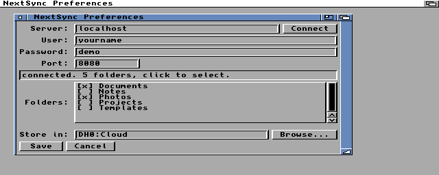

# NextSync

A Nextcloud client for AmigaOS 3.1 and later. Keeps folders on your Amiga in
sync with folders on a Nextcloud server, over HTTPS with real certificate
verification.


Around 49 KB. Workbench GUI and a scriptable CLI in one binary. Targets the
A1200 and A4000; tested on 68020 without an FPU and on 68040.

---

## New in 1.1

- **Set up from the GUI.** Project → Preferences holds the server details,
  the folders and the local drawer. Nothing has to be written by hand.
- **Connect tests the server and lists what is on it.** The folders on
  your account appear in a box you tick — no typing paths, no guessing at
  their names. A server that will not answer says so, there and then.
- **Browse** picks the local drawer with the standard file requester.
- **First run opens Preferences by itself** when there is no
  configuration yet.
- **The password is not on show.** The field holds asterisks; the
  character you have just typed stays legible until the next one, and is
  covered as soon as you leave the field.
- **A sync can be stopped.** The Sync now button becomes Stop sync while
  one is running — so can ESC, or the close gadget. It stops after the
  file in flight, and everything already transferred is kept.
- **Directory trees are removed properly.** Deleting a folder on one side
  now clears the whole tree on the other in a single run, deepest drawer
  first, instead of leaving the empty drawers behind.
- **A turnkey emulator** and an offline test server, both below.

1.0 configuration files still work as they are.

## What it does

- **Two way sync.** Changes on either side are carried to the other. New
  files, modified files, new directories, deletions. Folders are followed
  all the way down, not just their top level.
- **Change detection that survives reboots.** The server's etag and the
  local size and modification time are recorded after every transfer, so a
  second run transfers nothing and a third run after editing one file
  transfers exactly that file.
- **Conflicts are never resolved by losing data.** If a file changed on
  both sides, the local copy is renamed to `<name>.conflict` and the server
  version is downloaded, so both survive.
- **Deletions are safe on first contact.** A deletion is only propagated
  for a file the state file proves was synced before, so pointing NextSync
  at a folder that already has content never deletes anything.
- **Streaming transfers.** 16 KB blocks; files never have to fit in RAM.
  Downloads land in `<name>.nspart` and are renamed into place only when
  complete, so an interrupted transfer cannot leave a corrupt file. A
  transfer that stops early is a failure, not a short file: the byte
  count is checked against the length the server declared, and a
  `.nspart` still lying about from a crash is thrown away rather than
  mistaken for something of yours and uploaded.
- **TLS 1.3** via AmiSSL v5, verified against the AmiSSL CA store.
- Local modification times are preserved on the server (`X-OC-MTime`).

## Requirements

| | |
|---|---|
| AmigaOS 3.1 or later, 68020+ | AmiSSL v5 needs a 68020 |
| ~6 MB free RAM | OpenSSL 3.x is not small |
| A TCP/IP stack | Roadshow, AmiTCP, Miami — anything with `bsdsocket.library` v4 |
| [AmiSSL 5.x](https://github.com/jens-maus/amissl/releases) | run its installer; needs an `AmiSSL:` assign |
| `mathieeedoubbas.library` and `mathieeedoubtrans.library` in `LIBS:` | ships with Workbench; AmiSSL's startup needs them |

## Installing on a real Amiga

1. Install AmiSSL 5.x with its own installer.
2. Copy `NextSync` anywhere you like.
3. Start it. With no configuration it opens Preferences straight away.

## Setting it up



Project → Preferences, or the dialog that opens by itself on a first run:

1. Type the server address, your user name and your password.
2. **Connect.** NextSync opens the connection there and then; if it
   cannot, it tells you why and nothing is saved. On success the box
   fills with the folders in your account.
3. Click a folder to tick it. Ticked folders are the ones that sync.
4. **Browse** for the drawer they should be kept in, or type a path.
5. **Save.**

Use a Nextcloud **app password** (Settings → Security on the server) rather
than your account password. The dialog does not show the password back to
you, but **the file it writes is plain text** — AmigaOS has nowhere to
keep a secret, and the password has to be presented to the server on every
request, so it cannot be one-way hashed either. An app password limits
what a reader of that file gets, and can be revoked on its own without
touching your account.

The folder list is one level deep — the folders in your file root. That is
what you pick; syncing then follows each one all the way down.

### The file it writes

`NextSync.conf`, in the same drawer as the program (`PROGDIR:`):

```
server  cloud.example.com
port    443
user    yourname
pass    your-app-password

local   DH0:Nextcloud
folder  Documents
folder  Photos
```

`local` is the drawer the folders live in, one `folder` line per synced
folder, up to 16. Both sides are created if they are missing.

NextSync 1.0 wrote explicit pairs instead, and they still work:

```
pair    /Photos    Work:Cloud/Pictures
```

Those are synced as before, shown in Preferences, and written back out
unchanged when you save — so an existing setup survives the upgrade, and a
folder that has to live somewhere unusual can still be pinned by hand.

## Using it

```
NextSync            open the GUI
NextSync SYNC       sync everything and exit, for scripts and startup
NextSync LIST [p]   list a server directory
NextSync PREFS      open Preferences on its own
```

Add `SNAPSHOT` to any of those to save a screen dump to `out/` once the
window has drawn itself, and exit.

**Stopping a sync.** In the GUI, the Sync now button reads Stop sync while
one is running; ESC and the close gadget do the same thing. From the CLI,
CTRL-C. All of them stop after the file being transferred finishes, so
nothing is left half written, and what has already been transferred stays
— the next run picks up from there.

## How the sync decides what to do

For each path it compares three things: what is on the server, what is on
disk, and what the state file (`.nextsync.state`, inside the local folder)
says about the last successful sync.

| server | local | last sync | action |
|---|---|---|---|
| present, etag changed | unchanged | known | download |
| unchanged | changed | known | upload |
| present | missing | known | delete on server |
| missing | present | known | delete locally |
| present | missing | unknown | download (it is new) |
| missing | present | unknown | upload (it is new) |
| changed | changed | known | conflict: local → `.conflict`, then download |

Delete the state file to force a full re-comparison; nothing is lost,
NextSync just re-examines everything.

## Known limits

- File names containing `:` cannot exist on an Amiga filesystem and are
  skipped with a log line. Length limits are left to the filesystem: FFS
  rejects names over 30 characters, PFS3 and SFS allow around 100.
- UTF-8 names pass through as bytes. Non-ASCII names look wrong in
  Workbench but round trip to the server unchanged.
- Times are treated as UTC on both sides. Set your Amiga clock to UTC, or
  accept a constant offset — the state model tolerates it after the first
  run either way.
- One connection, one transfer at a time. This is a 68020.
- Nextcloud chunked upload is not implemented, so very large uploads depend
  on the server's request timeout.

---

## Building

You need the cross toolchain and the AmiSSL SDK. Both are fetched by
scripts; neither is committed here.

```bash
tools/build-toolchain.sh     # m68k-amigaos-gcc into toolchain/, ~20 min, once
tools/fetch-deps.sh          # AmiSSL 5.27 SDK + runtime into vendor/
make                         # -> ./NextSync
```

If you already have a toolchain or SDK elsewhere:

```bash
make TOOLCHAIN=/opt/amiga AMISSL_SDK=/path/to/AmiSSL/Developer
```

`make CPU=68030` and `make DEBUG=1` do what you would expect.

## Running it on an emulated Amiga

One command builds NextSync, installs it with a Workbench icon on a
bootable Workbench 3.1 drive, and boots you into it:

```bash
tools/emulator.sh
```

Open the **DH0** icon, double click **NextSync**. Networking is the host's,
through Amiberry's `bsdsocket` emulation, so there is no TCP/IP stack to
configure inside the guest. F12 opens Amiberry's own menu; quit from there.

```bash
tools/emulator.sh a1200      # stock A1200 speed instead of an A4000/040
tools/emulator.sh --fresh    # set the configuration aside, so Preferences
                             # opens on startup like a first run
tools/emulator.sh --shell    # boot to a Shell instead of Workbench
```

`emu/hd0` on the Mac *is* `DH0:` in the guest, both ways, live — so a file
dropped in there shows up on the Amiga, and anything synced down is on
your Mac immediately.

### What it needs first

```bash
brew install --cask amiberry
pip3 install amitools                             # for xdftool

# a Kickstart 3.1 ROM for the A1200 or A4000 in kickstarts/
tools/setup-sysdrive.sh /path/to/WORKBENCH.ADF    # builds emu/hd0
tools/fetch-deps.sh && tools/install-amissl.sh emu/hd0
```

`tools/emulator.sh` checks each of these and prints the command that fixes
whichever is missing. Kickstart ROMs and Workbench disks are Commodore's,
so they are not in this repository.

### Without a Nextcloud account

`tools/mockdav.py` is a small server that speaks the part of Nextcloud's
WebDAV that NextSync uses, backed by an ordinary directory:

```bash
python3 tools/mockdav.py emu/mockdav 8080
```

Point NextSync at `localhost` port **8080** (not 443, which means TLS) with
any user name and password. The documentation screenshots above were taken
against it.

### Scripted tests

```bash
tools/run-emu.sh "NextSync SYNC >out/sync.log"        # 68040 + JIT, quick
tools/run-emu.sh "NextSync SYNC >out/sync.log" a1200  # stock A1200 timing
tools/run-emu.sh "NextSync GUITEST"                   # syncs and snapshots
tools/run-emu.sh "NextSync PREFSTEST >out/p.log"      # drives Preferences
```

These boot, run one command, and report — no window to click. Note that
they replace `S/Startup-Sequence` with a scripted one, and
`tools/emulator.sh` puts the Workbench boot back; whichever ran last
decides how `DH0:` starts.

FS-UAE 3.x is **not** usable for any of this: its CPU core predates 2017
and double-faults inside AmiSSL's library init.

Anything the guest writes to `out/` appears on the host immediately; that is
how logs and results come back. Screen snapshots are taken by the Amiga
itself and converted to PNG by `tools/ags2png.py`, so no host screen capture
is involved.

## Packaging for Aminet

```bash
tools/mkdist.sh
```

Builds, stages the drawer with its Workbench icons, and checks the things
Aminet would otherwise bounce it for: the readme's mandatory fields, its
78 column limit and 40 character `Short:`, file names within 30
characters, every link in the AmigaGuide resolving, and the `$VER:` string
in the binary agreeing with the version in the readme.

The result is in `dist/`: `stage/` is exactly what goes in the archive, and
`NextSync.readme` is uploaded *beside* it rather than inside. Aminet takes
LhA or zip; `mkdist.sh` writes the zip, and prints the LhA command for a
machine that has a real LhA (Homebrew's `lha` is Lhasa, which only
extracts).

The readme and the manual are hand written in `aminet/`.

## Source layout

| | |
|---|---|
| `src/nshttp.c` | HTTP/1.1 on bsdsocket.library, TLS via AmiSSL, keep-alive, chunked encoding, streaming to and from files |
| `src/nsxml.c` | small SAX parser, enough for DAV multistatus |
| `src/nsdav.c` | PROPFIND / GET / PUT / MKCOL / DELETE against `remote.php/dav` |
| `src/nssync.c` | the three-way comparison and the transfer decisions |
| `src/nsconf.c` | the configuration file |
| `src/gui.c` | Workbench interface |
| `src/nsprefs.c` | the Preferences dialog |
| `src/nstest.c` | synthetic keystrokes, so the self tests can reach paths only a keyboard can |
| `agui/` | the Intuition/GadTools application framework this is built on, bundled from [amiga-devkit](https://github.com/amiwoodcarver/amiga-devkit) |
| `tools/mkicon.py` | draws the Workbench icon, geometry rather than a blob |
| `tools/mockdav.py` | the offline stand-in for a Nextcloud server |

`src/nsxml.c` has no OS dependencies and can be compiled and tested on the
host directly.

## Platform notes

Seven AmigaOS specifics cost real debugging time here. They are written up in
**[docs/platform-notes.md](docs/platform-notes.md)** — worth reading before
touching the AmiSSL or linking setup, and possibly useful for anyone else
writing a networked Amiga program in 2026.
